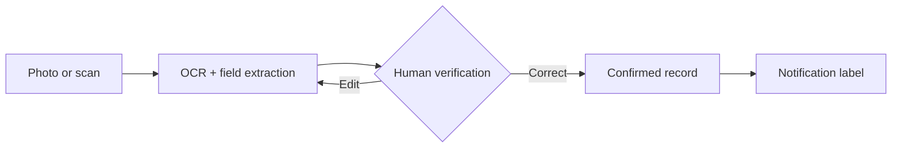

# MDE Smart Scan

> **One photo → verified shipment data → printable notification.**

[](https://github.com/Mario8802/mde-smart-scan/actions/workflows/ci.yml)


MDE Smart Scan is a privacy-first proof of concept for postal delivery devices. It uses OCR to extract the shipment type, tracking number, recipient and address from RSa, RSb and registered-letter documents, asks the delivery worker to verify the result, and prepares a printable notification.

**Kurz gesagt:** Weniger manuelle Eingabe am MDE, weniger Übertragungsfehler und mehr Zeit für die eigentliche Zustellung.

This is an independent portfolio prototype built with synthetic data. It is not an official Österreichische Post product and does not connect to internal systems.

## Why this exists

Older registered items can reach a delivery route without all required fields already available in the MDE workflow. Re-entering information while delivering costs time and creates avoidable transcription risk.

MDE Smart Scan demonstrates a safer flow:



The important design decision is the verification step: OCR proposes; the delivery worker decides.

## Product highlights

- Mobile-first MDE interface with camera capture
- Tesseract OCR with German and English language support
- Rule-based extraction for RSa, RSb and Einschreiben fields
- Human-in-the-loop review before any downstream action
- Printable notification label and traceable audit events
- Privacy mode: source images are never persisted; raw OCR text is off by default
- Transparent impact calculator with clearly labeled assumptions
- JSON endpoints for scan history, impact modelling and health checks
- Synthetic one-click demo—safe for presentations and screenshots
- Docker setup, Django checks, pytest suite and GitHub Actions CI

## Quick start

### Local Python

Requirements: Python 3.12+, Tesseract 5 and the German/English language packs.

```bash
git clone https://github.com/Mario8802/mde-smart-scan.git
cd mde-smart-scan
python -m venv .venv
source .venv/bin/activate  # Windows: .venv\Scripts\activate
pip install -r requirements-dev.txt
python manage.py migrate
python manage.py seed_demo
python manage.py runserver
```

Open [http://127.0.0.1:8000](http://127.0.0.1:8000) or press **30-Sekunden-Demo** on the dashboard.

### Docker

```bash
docker compose up --build
```

## How the OCR pipeline works

1. Django keeps the uploaded image in memory and enforces an 8 MB limit.
2. Pillow validates the file, fixes EXIF rotation, converts it to grayscale and improves contrast.
3. Tesseract extracts text; the configured German model falls back to English when unavailable.
4. The field extractor normalizes tracking numbers and maps labeled or block-style addresses.
5. A confidence score communicates completeness—not artificial certainty.
6. The worker reviews every field before confirming the record.
7. The source image is discarded. Raw OCR storage is disabled by default.

## API surface

| Endpoint | Purpose |
|---|---|
| `GET /health/` | Lightweight service health check |
| `GET /api/v1/scans/` | Last 50 normalized scan records |
| `GET /api/v1/impact/` | Configurable time-saving estimate |

Example:

```bash
curl "http://127.0.0.1:8000/api/v1/impact/?manual_seconds=42&smart_scan_seconds=12&items_per_day=24&workdays=220"
```

## Privacy and production boundary

The repository intentionally contains no real customer, employee or shipment data. Demo names, addresses and tracking numbers are fictional.

For a production pilot, the following would be required before real data is processed:

- approved authentication and role mapping for MDE users;
- internal shipment and printer API contracts;
- a DPIA/data-protection review and defined retention policy;
- encrypted transport and managed secrets;
- centrally managed audit logging without unnecessary PII;
- device testing, accessibility review and measured OCR quality thresholds;
- fallback workflow for low confidence and offline operation.

See [Pilot proposal (DE)](docs/PILOT_PROPOSAL_DE.md), [architecture](docs/ARCHITECTURE.md) and the [two-minute demo script](docs/DEMO_SCRIPT_DE.md).

## Test the project

```bash
pytest
python manage.py check
```

The tests cover extraction, workflow state changes, privacy-sensitive upload validation, APIs and the impact calculation.

## Roadmap

- Hardware scanner / camera adapter for the target MDE fleet
- Barcode-first extraction with OCR as a complementary signal
- Offline queue with idempotent synchronization
- Authorized shipment lookup and route-context enrichment
- Real printer adapter for notification labels
- Pilot dashboard for latency, correction rate and time-on-task

## License

[MIT](LICENSE) — created as an independent engineering and product-thinking portfolio project.
