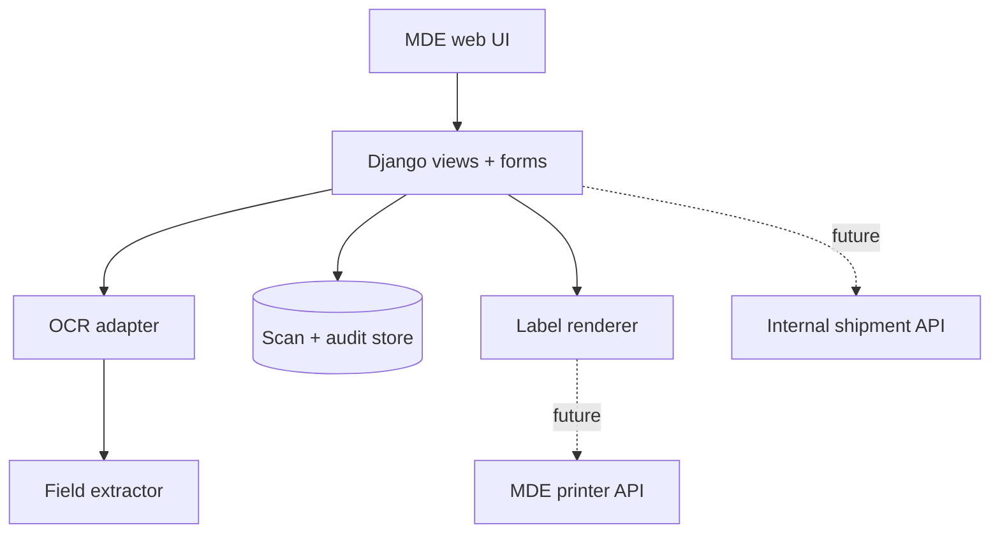
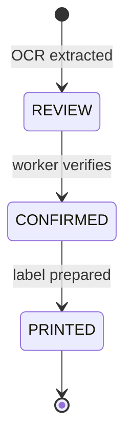

# Architecture

MDE Smart Scan is structured as a small modular monolith. That keeps the prototype easy to run while preserving clean boundaries for a later internal integration.

## Components

| Component | Responsibility | Production evolution |
|---|---|---|
| Capture UI | Camera/upload and safe demo mode | Native MDE scanner adapter |
| OCR service | Image validation, preprocessing and Tesseract | Approved on-device or internal OCR service |
| Extractor | Deterministic normalization and field mapping | Versioned rules plus barcode signals |
| Review workflow | Human confirmation and status transitions | Authenticated MDE operator identity |
| Audit events | Minimal workflow trace | Central append-only audit service |
| Label view | Printable browser label | Authorized mobile printer SDK/API |
| Impact API | Transparent hypothesis calculator | Pilot telemetry and measured baselines |

## State model

No label can be prepared while a record remains in `REVIEW`.

## Data minimization

- The original upload is processed in memory and is not attached to a database model.
- The configured upload threshold keeps accepted images in memory.
- Raw OCR text is disabled by default through `STORE_RAW_OCR=false`.
- Demo mode stores raw text only because all included values are synthetic.
- The database stores only the fields required to demonstrate the workflow.
- Application logs do not include the uploaded image or extracted PII.

The prototype demonstrates the pattern; a real rollout still requires a formal retention policy, device security controls and a data-protection review.

## Reliability decisions

- Duplicate tracking numbers are idempotently routed to the existing record.
- OCR failure produces a recoverable user-facing error.
- A missing tracking number creates a temporary review reference rather than silently inventing a valid identifier.
- Confidence is based on extracted-field completeness and is never used to bypass human review.
- External integrations are deliberately absent until an authorized contract is available.

## Scaling path

SQLite is appropriate for a local prototype. A pilot would move persistence to the approved managed database, use a background OCR queue, introduce authenticated device identities and add offline-first synchronization with idempotency keys.
