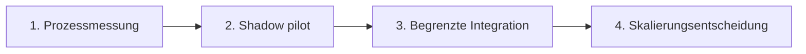

# Pilotvorschlag: MDE Smart Scan

## Zielbild

Zusteller:innen erfassen RSa-, RSb- und Einschreiben-Daten mit Kamera oder Scanner. Das MDE schlägt die erkannten Felder vor, die Person prüft sie und bestätigt den Vorgang. Anschließend werden bestehende autorisierte Prozesse zur Registrierung und zum Benachrichtigungsdruck angestoßen.

## Problemhypothese

Bei Sendungen, deren benötigte Daten nicht vollständig im MDE vorliegen, entstehen manuelle Eingaben. Dadurch können entstehen:

- zusätzliche Zeit am Zustellpunkt;
- Übertragungsfehler bei langen Sendungsnummern;
- Medienbrüche zwischen Brief, MDE und Drucker;
- weniger Zeit für die eigentliche Zustellung.

Diese Punkte sind Hypothesen aus der Arbeitspraxis und müssen vor einer Investitionsentscheidung mit echten, autorisierten Prozessdaten validiert werden.

## Pilotumfang

Ein sinnvoller erster Pilot wäre bewusst klein:

1. eine Zustellbasis und wenige freiwillige Zusteller:innen;
2. ausschließlich ein klar definierter Sendungstyp;
3. zunächst Shadow Mode ohne produktive Buchung;
4. Vergleich von manueller Eingabe und Smart-Scan;
5. Go/No-Go nach messbaren Ergebnissen und Nutzerfeedback.

## Erfolgsmessung

| Kennzahl | Definition | Warum sie zählt |
|---|---|---|
| Time on task | Sekunden von Erfassung bis Bestätigung | Direkter Produktivitätsindikator |
| Field correction rate | Anteil manuell korrigierter OCR-Felder | Qualitäts- und Trainingssignal |
| End-to-end success | Vorgänge ohne technischen Abbruch | Zuverlässigkeit im Außendienst |
| Duplicate/error rate | Doppelte oder ungültige Vorgänge | Prozesssicherheit |
| User effort | Kurze Bewertung durch Zusteller:innen | Akzeptanz und Ergonomie |

Es werden keine erfundenen Einsparungsversprechen gemacht. Der integrierte Rechner zeigt nur transparente Beispielannahmen.

## Sicherheits- und Datenschutz-Gates

Vor einem Pilot mit echten Daten:

- Datenschutz-Folgenabschätzung bzw. Prüfung durch die zuständigen internen Stellen;
- Zweckbindung, Datenminimierung und Löschfristen;
- MDE-Authentifizierung und rollenbasierte Berechtigungen;
- verschlüsselte Kommunikation und verwaltete Secrets;
- keine Speicherung der Originalbilder, sofern nicht ausdrücklich erforderlich und genehmigt;
- Audit-Protokoll ohne unnötige personenbezogene Daten;
- Penetrationstest und sichere Software-Lieferkette;
- definierter manueller Fallback.

## Integrationen

Der Prototyp simuliert zwei bewusst offene Schnittstellen:

1. **Shipment Registry** – validiert und registriert die Sendung im autorisierten Bestandssystem.
2. **Printer Adapter** – übergibt ausschließlich freigegebene Benachrichtigungsdaten an den MDE-Drucker.

Die konkreten internen API-Verträge können nur gemeinsam mit den zuständigen Product-, Security- und IT-Teams definiert werden.

## Rollout in vier Schritten

Der Vorteil dieses Vorgehens: Früh lernen, wenig Risiko eingehen und erst nach belastbaren Ergebnissen skalieren.
